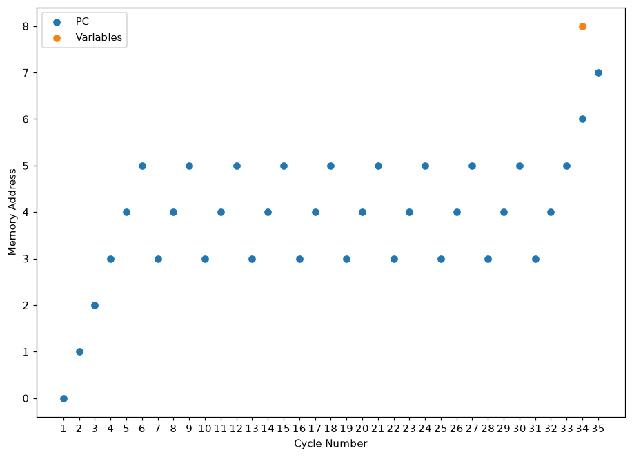

# CustomAssembler

A two-pass assembler and a cycle-stepping simulator for a custom 16-bit instruction
set, written in Python with no dependencies outside the standard library (the
plotting simulator additionally needs matplotlib).

University computer-organisation project, June–September 2022, by
**Shivoy Arora**, **Suhani Mathur** and **Shobhit Pandey**.



*The simulator's trace for `sample/countup.asm`: the program counter climbs through
the three setup instructions, then cycles over addresses 3–4–5 ten times as the loop
runs, and finally falls through to the store and halt. The orange point is the
variable written on exit.*

## The machine

- **16-bit words.** Registers hold unsigned values 0–65535; arithmetic wraps and sets
  the overflow flag.
- **Seven general registers**, `R0`–`R6`, encoded `000`–`110`, plus `FLAGS` at `111`.
- **256 words of memory**, shared by program and data — the program is loaded at
  address 0 and variables are allocated after the last instruction.
- `FLAGS` is written by `cmp` and by overflow, and cleared by every other
  instruction. Reading left to right, the low four bits are
  **overflow**, **less than**, **greater than**, **equal**.

## Instruction encoding

Every instruction is exactly 16 bits: a 5-bit opcode followed by a layout that depends
on the statement type.

| Type | Layout (bits, left to right) | Example |
|---|---|---|
| **A** | opcode(5) · unused(2) · reg1(3) · reg2(3) · reg3(3) | `add R1 R2 R3` |
| **B** | opcode(5) · reg(3) · immediate(8) | `mov R1 $5` |
| **C** | opcode(5) · unused(5) · reg1(3) · reg2(3) | `cmp R1 R3` |
| **D** | opcode(5) · reg(3) · address(8) | `st R3 total` |
| **E** | opcode(5) · unused(3) · address(8) | `jlt loop` |
| **F** | opcode(5) · unused(11) | `hlt` |

Type A takes its **destination last**: `add R1 R2 R3` computes `R3 = R1 + R2`.

Worked example — `add R1 R2 R3` assembles to `1000000001010011`:

```
10000    00      001   010   011
opcode   unused  R1    R2    R3
add                    sources  destination
```

## Instruction set

Twenty opcodes.

| Mnemonic | Opcode | Type | Meaning |
|---|---|---|---|
| `add` | `10000` | A | `reg3 = reg1 + reg2` |
| `sub` | `10001` | A | `reg3 = reg1 - reg2` |
| `mul` | `10110` | A | `reg3 = reg1 * reg2` |
| `xor` | `11010` | A | bitwise exclusive or |
| `or`  | `11011` | A | bitwise or |
| `and` | `11100` | A | bitwise and |
| `mov` | `10010` | B | load an 8-bit immediate, written `$n` |
| `rs`  | `11000` | B | right shift by an immediate |
| `ls`  | `11001` | B | left shift by an immediate |
| `mov` | `10011` | C | copy one register to another |
| `div` | `10111` | C | `R0 = quotient`, `R1 = remainder` |
| `not` | `11101` | C | bitwise complement |
| `cmp` | `11110` | C | compare, writing `FLAGS` |
| `ld`  | `10100` | D | load from memory into a register |
| `st`  | `10101` | D | store a register into memory |
| `jmp` | `11111` | E | unconditional jump |
| `jlt` | `01100` | E | jump if the last `cmp` was less than |
| `jgt` | `01101` | E | jump if greater than |
| `je`  | `01111` | E | jump if equal |
| `hlt` | `01010` | F | halt |

`mov` is one mnemonic covering two encodings; the assembler picks type B when the
second operand starts with `$` and type C otherwise.

## Running it

Both tools read from standard input and write to standard output.

```sh
python3 SimpleAssembler.py < sample/countup.asm > countup.bin
python3 SimpleSimulator.py < countup.bin
```

The simulator prints one line per cycle — the program counter in 8 bits, then `R0`
through `R6` and `FLAGS` in 16 bits each — and then dumps all 256 memory words.

To get the plot at the top of this file instead of a text trace:

```sh
python3 simulator_plot.py < countup.bin
```

## Worked example

`sample/add.asm`:

```
var result
mov R1 $5
mov R2 $7
add R1 R2 R3
st R3 result
hlt
```

Assembles to (`sample/add.bin`):

```
1001000100000101
1001001000000111
1000000001010011
1010101100000101
0101000000000000
```

Running it, the last cycle's registers are:

```
PC       R0               R1               R2               R3
00000100 0000000000000000 0000000000000101 0000000000000111 0000000000001100
```

`R3` holds `0000000000001100` — 12, the sum of 5 and 7 — and the memory dump has the
same value at address 5, where `result` was allocated.

`sample/countup.asm` is the loop plotted above: it adds 1 to `R1` until `R1` reaches
10, taking 35 cycles.

## Files

| File | What it is |
|---|---|
| `SimpleAssembler.py` | the two-pass assembler for the base instruction set |
| `SimpleSimulator.py` | the cycle-stepping simulator |
| `assembler_float.py` | the assembler extended with floating-point operations |
| `simulator_float.py` | the matching simulator |
| `simulator_plot.py` | the simulator with the program-counter plot |
| `memory_calculator.py` | a separate interactive calculator for memory and ISA sizing questions |

The first pass records the address of every label and `var` declaration; the second
emits code, so a jump can refer to a label defined later in the file. Errors are
reported with a line number, but the assembler still exits zero — check its output
rather than its exit status.
